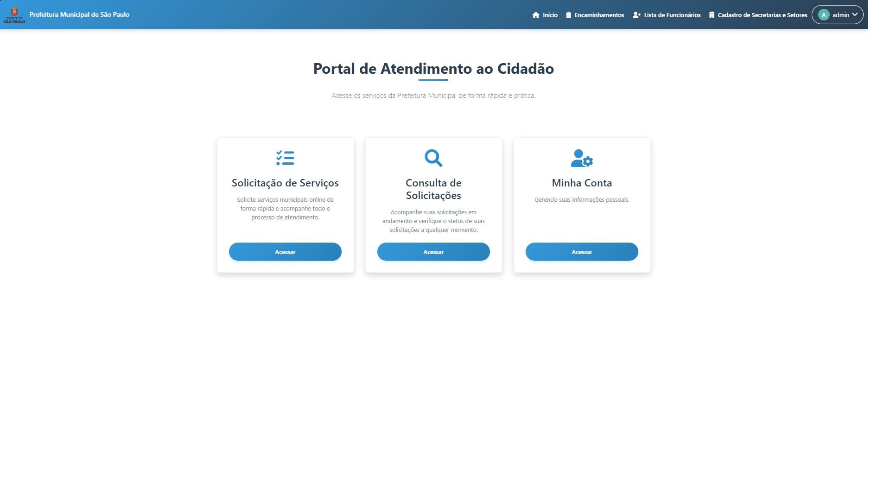
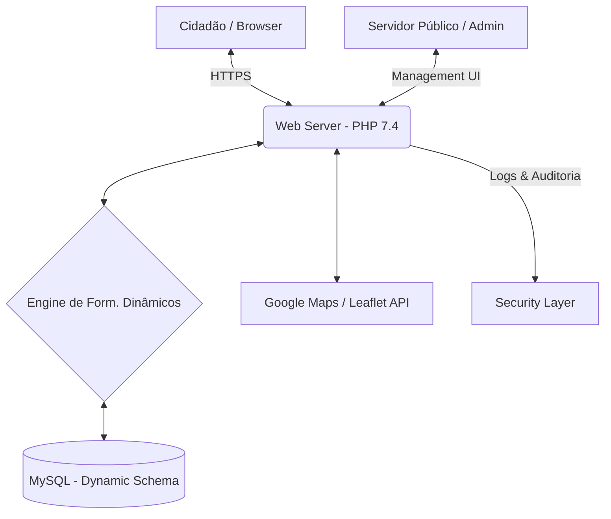
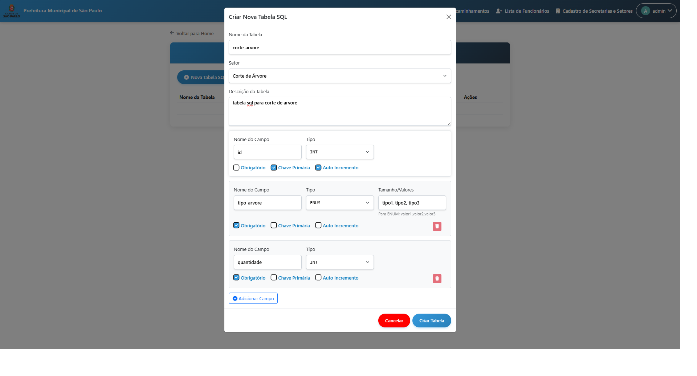
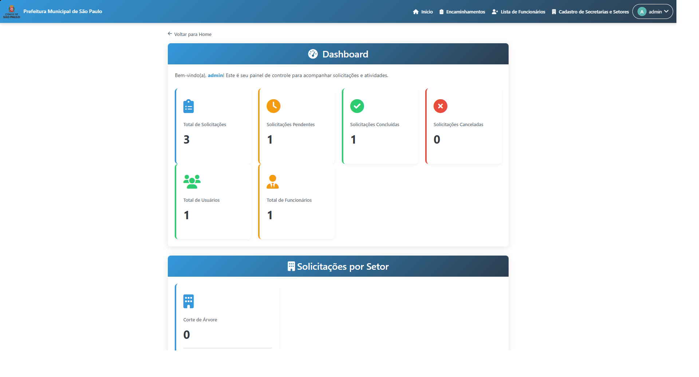

# 🏛️ Portal do Cidadão & Gestão de Solicitações (e-Gov)

> Uma plataforma completa de governo digital que conecta cidadãos aos serviços públicos, permitindo abertura de protocolos, georreferenciamento de problemas urbanos e gestão inteligente para secretarias.

**Link de Demonstração:** [prefeitura.final.jsatecsistemas.com.br](https://prefeitura.final.jsatecsistemas.com.br)



## 🎯 Objetivo e Problema

### O Problema
A gestão pública municipal frequentemente sofre com a fragmentação de canais de atendimento. Protocolos abertos via telefone, papel ou e-mail dificultam o rastreio, impedem a análise de dados geográficos das demandas e sobrecarregam as secretarias com processos manuais e repetitivos.

### O Objetivo
Digitalizar a jornada do cidadão e do servidor público. O portal centraliza todas as demandas, automatiza o encaminhamento entre setores, fornece um mapa de calor das ocorrências para planejamento urbano e permite a criação de novos serviços de forma dinâmica, sem necessidade de novas implementações de código.

## 🏗️ Arquitetura do Sistema



O diferencial técnico deste projeto é a sua **Engine DDL Automática**, que permite ao administrador gerenciar o esquema do banco de dados através de uma interface visual.

## 🛠️ Tecnologias Utilizadas

**Backend & Banco de Dados**
*  **PHP Nativo:** Arquitetura procedural/MVC otimizada.
*  **MySQL:** Gestão de schemas dinâmicos via `DDL`.

**Frontend & Mapas**
*  **Bootstrap 5.**
* 🗺️ **Leaflet.js:** Renderização de mapas e clusterização de marcadores.
* 📈 **Chart.js:** Dashboards analíticos.

## 🚀 Como Executar

### Desenvolvimento Local
1. Clone o repositório.
2. Configure um servidor Apache com PHP 7.4.
3. Importe os arquivos SQL base para o MySQL.
4. Ajuste as credenciais no arquivo `conexao.php`.

## 📡 Exemplos de API (Exemplos de Payload)

### Criar Novo Campo Dinâmico
**Request:** `POST /admin/api/create-field`
```json
{
  "tabela": "solicitacao_tapa_buraco",
  "nome_campo": "profundidade_estimada",
  "tipo": "ENUM",
  "opcoes": ["raso", "medio", "critico"]
}
```

**Response:**
```json
{
  "status": "success",
  "query": "ALTER TABLE solicitacao_tapa_buraco ADD profundidade_estimada ENUM('raso', 'medio', 'critico')"
}
```

## 📸 Interface do Sistema

| Portal do Cidadão | Mapa de Georreferenciamento |
|:---:|:---:|
|  |  |

| Gestão de Tabelas SQL | Dashboards |
|:---:|:---:|
|  |  |


---
**Nota:** Este repositório é um portfólio arquitetural. O código-fonte completo é privado para proteção de IP.

