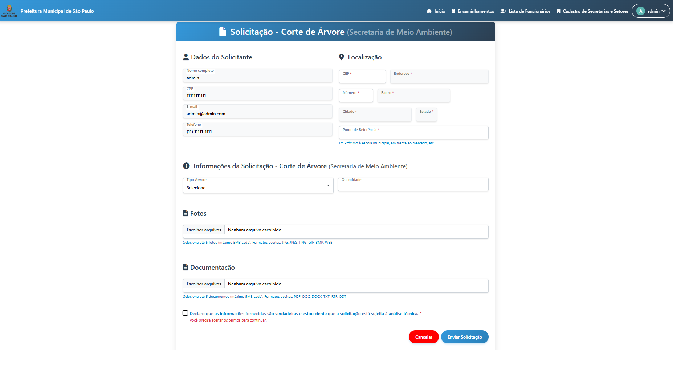
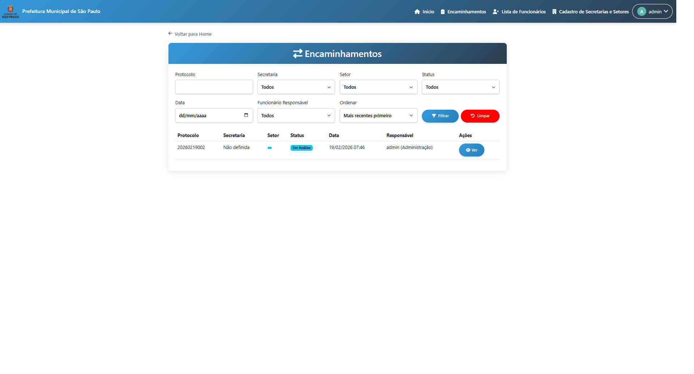
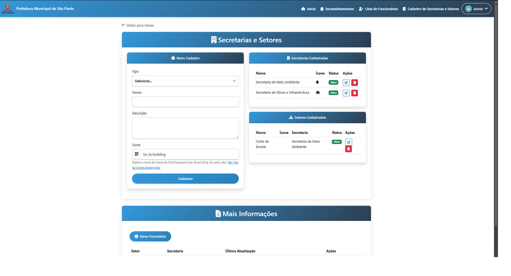
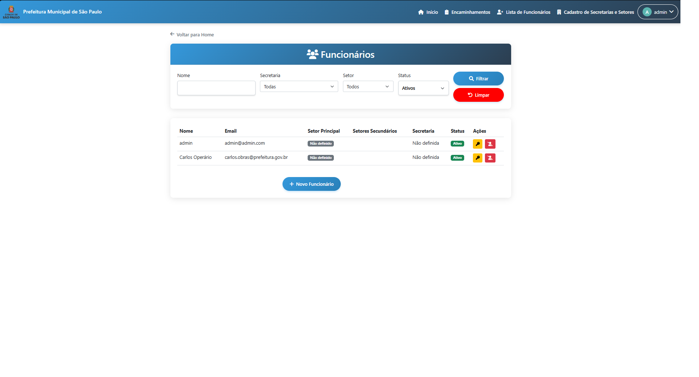
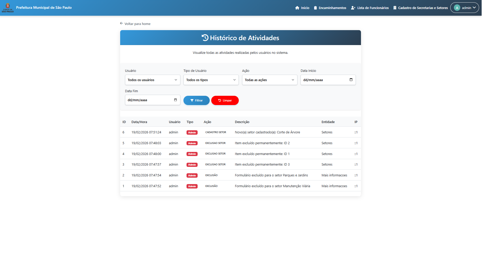

# 🏛️ Portal do Cidadão & Gestão de Solicitações (e-Gov)

> Uma plataforma completa de governo digital que conecta cidadãos aos serviços públicos, permitindo abertura de protocolos, georreferenciamento de problemas urbanos e gestão inteligente para secretarias.

## 📄 Sobre o Projeto

Este sistema foi desenvolvido para modernizar o atendimento público de ouvidorias e prestação de serviços (ex: tapa-buracos, poda de árvores, iluminação). Ele substitui processos manuais por um fluxo 100% digital, desde o pedido do cidadão até a conclusão pela equipe técnica.

O grande destaque arquitetural deste software é a sua **Engine de Formulários Dinâmicos**: o próprio sistema permite que o Administrador crie novos tipos de serviços e gere tabelas SQL e formulários em tempo real, sem necessidade de alterar o código-fonte.

### 🎯 Principais Funcionalidades

* **🗺️ Georreferenciamento de Ocorrências:**
    * Integração com a API do Google Maps para captura de coordenadas.
    * Mapa interativo (via `Leaflet.js` e `MarkerCluster`) mostrando a mancha de solicitações na cidade filtradas por status.
* **⚙️ Tabelas e Formulários Dinâmicos:**
    * Módulo onde o Admin desenha um formulário (Text, Enum, Date, Int).
    * O Backend (PHP) traduz essa configuração e executa comandos `CREATE TABLE` / `ALTER TABLE` no banco de dados automaticamente.
* **🔄 Gestão de Protocolos e Encaminhamento:**
    * Geração automática de números de protocolo (Ex: `000001/2026`).
    * Fluxo de trabalho (Workflow) repassando o ticket entre diferentes Secretarias e Setores.
* **📊 Dashboard Gerencial:**
    * Painel analítico com gráficos gerados em `Chart.js` (Evolução de 7 dias, demandas por secretaria e volumetria).
* **📎 Gestão de Mídias e Documentos:**
    * Upload múltiplo de fotos e documentos com validação de tamanho (max 5MB) e extensões.

## 🛠️ Tecnologias Utilizadas

**Backend & Banco de Dados**
*  **PHP Nativo:** Lógica de negócios e transações seguras de banco de dados (`begin_transaction`, `commit`, `rollback`).
*  **MySQL:** Estrutura relacional robusta com gestão e criação de tabelas dinâmicas (`DDL` via código).

**Frontend & APIs**
*  **Bootstrap 5 & jQuery:** Interfaces responsivas e requisições assíncronas (AJAX).
* 🗺️ **Leaflet & OpenStreetMap:** Renderização de mapas sem custos de API.
* 📈 **Chart.js:** Visualização de dados gerenciais.
* 📍 **ViaCEP API:** Autocompletar inteligente de endereços.

## 📸 Galeria do Sistema

| Portal do Cidadão | Dashboard Gerencial |
|:---:|:---:|
|  |  |
| *Acesso rápido aos serviços pelo munícipe* | *Métricas em tempo real para gestão pública* |

| Abertura de Protocolo (Cidadão) | Mapa de Solicitações (Georreferenciamento) |
|:---:|:---:|
|  |  |
| *Formulários montados on-the-fly pelo sistema* | *Clusterização de ocorrências no território* |

| Engine de Banco de Dados Dinâmico | Encaminhamentos e Fluxo |
|:---:|:---:|
|  |  |
| *Criação de tabelas e campos SQL via interface* | *Gestão de repasses de tickets e status* |

| Cadastro de Secretarias e Setores | Gestão de Funcionários |
|:---:|:---:|
|  |  |
| *Estruturação organizacional da prefeitura* | *Controle de servidores cadastrados* |

| Associação de Funcionários aos Setores | Histórico e Auditoria |
|:---:|:---:|
|  |  |
| *Definição de permissões de atendimento* | *Logs de atividades e ações no sistema* |

## ⚙️ Arquitetura de Tabelas Dinâmicas (Destaque Técnico)

Para evitar que o sistema precisasse de manutenção no código a cada nova Secretaria ou Serviço criado pela prefeitura, criei um script capaz de:
1. Receber um JSON com o descritivo de campos (Nome, Tipo de Dados, Nullable).
2. Sanitizar os inputs de nomes de colunas para prevenir SQL Injection.
3. Executar Queries DDL diretamente no MySQL (`CREATE TABLE novo_servico_xyz`).
4. Renderizar um loop dinâmico na tela do usuário no momento de abrir a solicitação, unindo os "Campos Padrões" (CEP, Foto) com os "Campos Dinâmicos".

---
**Nota:** Este é um projeto de código fechado. Este repositório serve como um portfólio arquitetural demonstrando minha capacidade de resolver problemas complexos (como geração dinâmica de schema de banco de dados e geolocalização) utilizando PHP e bases de dados relacionais.

📫 **Gostou do projeto?** Conecte-se comigo no LinkedIn ou por Email.
